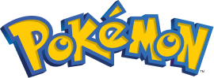
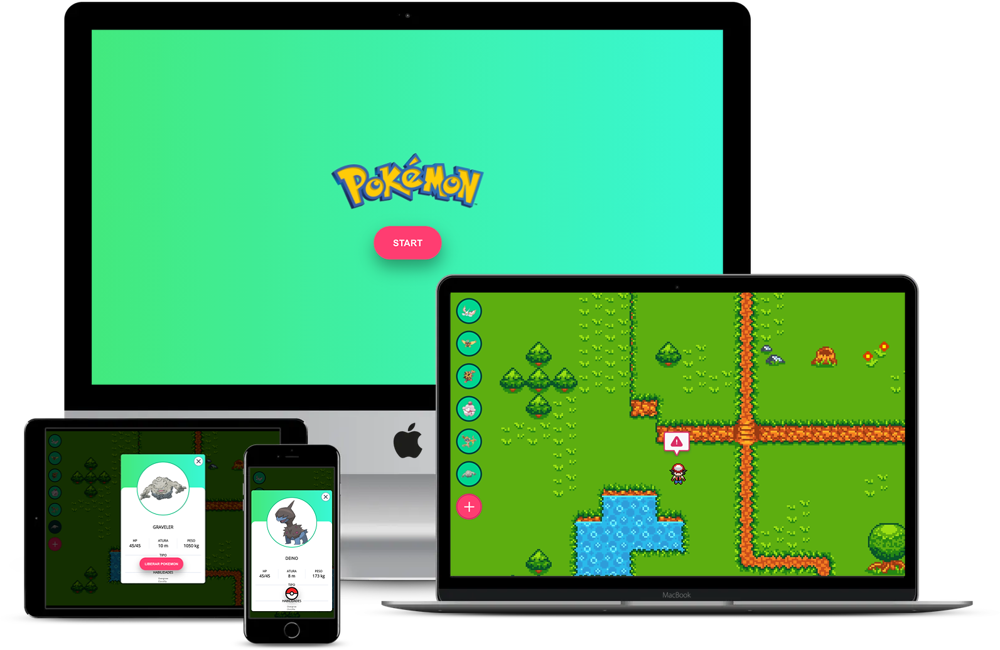

<h1 align="center">
    
    <br/><br/>
    Pokemon
</h1>

<p align="center">
  <a href="#sobre">Projeto</a>&nbsp;&nbsp;&nbsp;|&nbsp;&nbsp;&nbsp;
  <a href="#tecnologias">Tecnologias</a>&nbsp;&nbsp;&nbsp;|&nbsp;&nbsp;&nbsp;
  <a href="#setup">Setup</a>&nbsp;&nbsp;&nbsp;|&nbsp;&nbsp;&nbsp;
  <a href="#layout">Layout</a>&nbsp;&nbsp;&nbsp;|&nbsp;&nbsp;&nbsp;
  <a href="#licença">Licença</a>
</p>

<p align="center">
  
  
</p>

<div align="center">
  
  
  <a href="https://github.com/brunolagoa/challenge-pokemon/stargazers"></a>
  <a href="https://github.com/brunolagoa/challenge-pokemon/network/members"></a>
  <a href="https://github.com/brunolagoa/challenge-pokemon/pulls"></a>
  <a href="https://github.com/brunolagoa/challenge-pokemon/issues"></a>
  <a href="https://github.com/brunolagoa/challenge-pokemon/graphs/contributors"></a>
</div>

<br>

## Projeto

Projeto React utilizando a api do pokemon.

## Tecnologias

Esse projeto foi desenvolvido com as seguintes tecnologias:

- [Html](https://www.w3schools.com/html)
- [Css](https://www.w3schools.com/css/default.asp)
- [JavaScript](https://developer.mozilla.org/pt-BR/docs/Web/JavaScript)
- [React](https://reactjs.org)
- [TypeScript](https://www.typescriptlang.org)
- [PokeAPI](https://pokeapi.co/)

## Setup

```bash
# Clone o repositório em sua máquina
git clone https://brunolagoa.github.io/challenge-pokemon.git

# Entre no repositório
$ cd challenge-pokemon

# Instale as dependências
$ yarn

# Execute a aplicação
$ yarn start

# Será executado na port 3000, em seu navegador abra o link
http://localhost:3000
```

## Layout

<div align="center">
    
</div>
<br/><br/>

<!-- <p>Site publicado em:</p>
<a alt="Bruno Castro" target="_blank" rel="noopener noreferrer" href="https://brunolagoa.github.io/challenge-pokemon">Clique aqui para visualizar</a> -->

---


## Licença

Esse projeto está sob a licença MIT. Veja o arquivo [LICENSE](LICENSE.md) para mais detalhes.

---

<h3 align="center">
Autor: <a alt="Bruno Castro" target="_blank" rel="noopener noreferrer" href="https://brunocastro.dev">Bruno Castro</a>
</h3>

<p align="center">

  <a alt="Bruno Castro Linkedin" rel="noopener noreferrer" href="https://www.linkedin.com/in/brunovcastro">
    </a>
  <a alt="Bruno Castro GitHub" rel="noopener noreferrer" href="https://github.com/brunolagoa">
  </a>
  <a alt="Bruno Castro Site" rel="noopener noreferrer" href="https://brunocastro.dev">
  </a>

</p>
